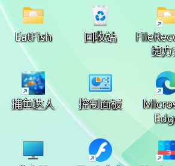

# 打印文件结构

```json
powershell

Get-ChildItem -Path "C:\java\java_project\eatfish" -Recurse | % { $_.FullName } > "C:\Users\lwr\Desktop\文件结构.txt"
```

# JDK 11 及以上版本默认不提供独立的 JRE 目录，需通过命令生成:

```json
jlink --module-path %JAVA_HOME%\jmods --add-modules java.desktop --output jre
```


# 开始


 
第一步：环境准备
位置：项目根目录（C:\java\java_project\eatfish）
cmd
```json

:: 进入项目根目录java_project就是存放项目的空间
cd C:\java\java_project\eatfish

:: 创建打包专用目录
mkdir dist
mkdir dist\lib
```


第二步：资源文件处理
位置：项目根目录

cmd

```json
:: 将图片资源复制到编译目录的 resources 文件夹
mkdir bin\resources
xcopy .\images bin\resources\images /E /I /Y
```

验证资源路径
确保代码中加载资源的路径正确：

```json
在java上实现

// 正确示例（从 classpath 加载）
ImageIcon icon = new ImageIcon(getClass().getResource("/resources/images/enemyFish/fish1_l.gif"));
```

其实上面这一步没什么用，因为如果你的java是在windows运行的话是看不出问题的，例如路径为：

"/resources/images/enemyFish/fish1_l.gif"

但实际你敲代码时大小写输错了变为:

"/resources/images/enemyfish/fish1_l.gif"

他也是可以运行的，但一打包成exe就会加载不出图片


第三步：生成可执行 JAR
位置：项目根目录

创建清单文件

cmd

```json
echo Main-Class: com.Main> MANIFEST.MF
echo Class-Path: .>> MANIFEST.MF
echo.>> MANIFEST.MF
```

打包所有内容

cmd

```json
:: 进入编译目录打包
cd bin
jar cvfm ..\dist\EatFish.jar ..\MANIFEST.MF com resources
cd ..
```

验证 JAR 结构
用压缩软件打开 dist\EatFish.jar，应包含：

```json
- com/ 
  └── Main.class 及其他class文件
- resources/
  └── images/
      ├── enemyFish/
      ├── myFish/
      └── *.jpg

```


第四步：制作 Windows EXE（无图标）

下载 Launch4j：http://launch4j.sourceforge.net

配置 Launch4j


注意：JDK11以上是不会生成jre的，要用上面的指令，在Launch4j.exe的文件夹下生成


之后你在launch4j的配置"Bundled JRE path: ./jre"才会有用

```json
Basic 标签

Output file: C:\java\java_project\eatfish\dist\EatFish.exe

Jar: C:\java\java_project\eatfish\dist\EatFish.jar

Icon 字段留空

JRE 标签

Min JRE version: 1.1

Bundled JRE path: ./jre
```

下面的按键就是保存设置


保存好后下次进来点击下面图标找到保存的xml就可以恢复设置了


最后点击这个就能生成exe了


这一步要注意你是不是安装了多个java版本，不然会导致生成的是一个java版本，实际运行环境的是另一个java版本,执行以下指令

```json

:: 2. 更新环境变量
set JAVA_HOME=C:\path\to\jdk-21（"your JDK"）
set PATH=%JAVA_HOME%\bin;%PATH%

:: 3. 重新运行
java -jar EatFish.jar

```

若上面都不行就删掉最低级的java版本或者删掉所有java，重装java

我的java是按照下面的安装的

```json
1. 安装JDK，见下面的链接：
https://blog.csdn.net/weixin_43247137/article/details/129349649

2.Eclipse下载安装配置详细图文教程
https://blog.csdn.net/xx781430229/article/details/129218150
```

第五步：集成 JRE 运行环境
位置：项目根目录

cmd

```json
xcopy "%JAVA_HOME%\jre" dist\jre /E /I /Y

```

注意：实现上面一步你要注意，就是你设置的"%JAVA_HOME%" 要有jre,还有安装的时候JAVA_HOME是对的,（jdk11以上是不会自动生成jre的）如果没有jre,就按照下面生成


一开始这个文件上面是没有jre的，执行了一开始最上面的“JDK 11 及以上版本默认不提供独立的 JRE 目录，需通过命令生成:”
这里的命令才生成的，但还要注意你的java不是多个版本导致环境混乱


上面第五步完成后，点击launch4j的蓝色三角符号就是运行exe

如果出问题了问题，就重新生成exe,在下面的位置加这个：


运行出错的日志就会生成：


里面存储了出错的信息，还有当你是launch4j里面运行exe出错时，log也会报错


上面的第五步其实自己在dist里添加jre也是行得通的，就是把jre直接复制过来或者右键打开终端，执行生成jre的指令就行

第六步：创建绿色版启动脚本
位置：dist 目录

cmd

```json
echo @echo off > dist\启动游戏.bat
echo title 捕鱼达人 >> dist\启动游戏.bat
echo start "" "%~dp0EatFish.exe" >> dist\启动游戏.bat
echo exit >> dist\启动游戏.bat
```
第七步：制作安装包（Inno Setup）

这里要先下载Inno Setup

官网链接：
http://www.jrsoftware.org/isdl.php

教程csdn上有

位置：项目根目录(与dist同级)

修改安装脚本 setup.iss

setup.iss自己要写的，内容如下：

```json

[Setup]
AppName=捕鱼达人
AppVersion=1.0
DefaultDirName={pf}\EatFish
OutputDir=.\dist
OutputBaseFilename=EatFish_Setup
Compression=lzma2
SolidCompression=yes

[Files]
Source: "dist\EatFish.exe"; DestDir: "{app}"
Source: "dist\jre\*"; DestDir: "{app}\jre"; Flags: recursesubdirs


[Icons]
Name: "{group}\捕鱼达人"; Filename: "{app}\EatFish.exe"
Name: "{commondesktop}\捕鱼达人"; Filename: "{app}\EatFish.exe"

[Run]
Filename: "{app}\EatFish.exe"; Description: "启动游戏"; Flags: postinstall nowait
```

生成安装包

cmd

```json
iscc setup.iss
```

最终目录结构

```json
dist/
├── EatFish.exe          # 可执行文件
├── EatFish.jar          # 包含所有资源的 JAR
├── jre/                 # 完整的 JRE 运行环境
├── 启动游戏.bat         # 绿色版启动脚本
└── EatFish_Setup.exe    # 生成的安装包
```


至于代码部分我是根据哔哩哔哩的尚学堂的大鱼吃小鱼写的(但我增加和改了很多东西，不然生成的应用并不能像我下面描述的一样)

当你运行EatFish_Setup.exe就能生成安装包，装在你的电脑上


我安装在桌面上



能像一般软件一样直接卸载，在自己电脑上搜索也搜的到，很好删除

这里还有一个python实现icon图标生成的代码(效果非常不好，但能用)

```json
import logging
from PIL import Image, ImageFilter

logging.basicConfig(level=logging.INFO, format='%(asctime)s - %(levelname)s - %(message)s')


def enhance_small_icon(img, size):
    """针对小尺寸图标（≤32x32）的画质增强"""
    if max(size) <= 32:
        # 先模糊去噪再锐化，保留边缘
        img = img.filter(ImageFilter.BoxBlur(0.5))
        img = img.filter(ImageFilter.UnsharpMask(radius=1, percent=150, threshold=2))
        # 小尺寸强制使用最近邻插值保留硬边缘
        return img.resize(size, Image.NEAREST)
    return img.resize(size, Image.LANCZOS)  # 大尺寸保持高质量缩放


def convert_to_icon(input_path, output_path, sizes=None):
    """支持画质增强的 ICO 生成器（推荐原图≥256x256）"""
    try:
        with Image.open(input_path) as img:
            logging.info(f"处理图片: {input_path} ({img.size}px)")

            # 强制转换为支持透明通道的模式
            if img.mode not in {'RGBA', 'LA'}:
                img = img.convert('RGBA')
                logging.info("已转换为 RGBA 模式")

            # 尺寸标准化（去重+按从大到小排序）
            valid_sizes = sorted({(s, s) if isinstance(s, int) else s
                                  for s in (sizes or [(256, 256)])}, reverse=True)

            icon_images = []
            for size in valid_sizes:
                w, h = size
                if w != h or h != w:
                    logging.warning(f"忽略非正方形尺寸: {size}，强制转换为正方形")
                    continue  # ICO 要求正方形尺寸

                # 保持原图比例裁剪中心区域
                src_w, src_h = img.size
                min_len = min(src_w, src_h)
                crop_box = ((src_w - min_len) // 2, (src_h - min_len) // 2,
                            (src_w + min_len) // 2, (src_h + min_len) // 2)
                # crop_box 是一个元组，包含四个元素，格式为 (left, upper, right, lower)。
                # 这四个值分别指定了裁剪框的左边坐标、上边坐标、右边坐标和下边坐标，用于确定要从原始图像中裁剪出的区域。
                cropped = img.crop(crop_box)


                # 分尺寸策略处理
                processed = enhance_small_icon(cropped, (w, h))
                icon_images.append(processed)
                logging.info(f"生成尺寸: {w}x{h} ({processed.mode})")

            # 保存时按 ICO 规范排序（小尺寸在前）
            icon_images.sort(key=lambda x: x.size[0])

            icon_images[0].save(
                output_path,
                format='ICO',
                append_images=icon_images[1:],  # 添加所有后续尺寸
                sizes=[(s[0], s[0]) for s in [i.size for i in icon_images]]
            )
            logging.info(f"成功生成 {len(icon_images)} 种尺寸的 ICO: {output_path}")

    except FileNotFoundError:
        logging.error(f"文件不存在: {input_path}")
    except Exception as e:
        logging.error(f"处理失败: {str(e)}", exc_info=True)


# 使用示例（推荐原图≥256x256）
if __name__ == "__main__":
    convert_to_icon(
        input_path="大鱼吃小鱼游戏.png",
        output_path="游戏图标.ico",
        sizes=[16, 32, 48, 64, 128, 256]  # 支持单数字表示正方形

    )
```

